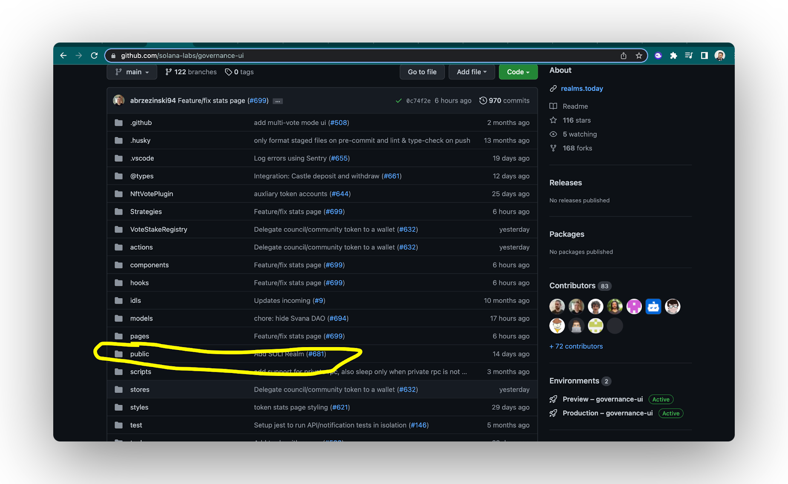
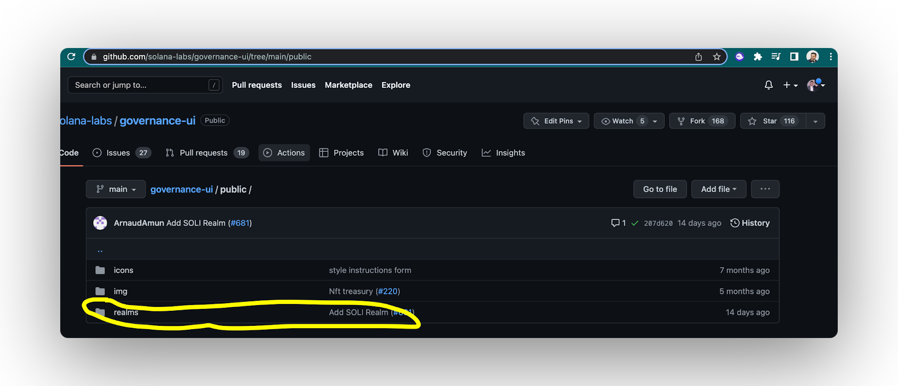

import { Callout } from 'nextra/components'
import { Steps } from 'nextra/components'

## How To Change Your DAO Logo & Banner

<Callout type="info" emoji="▶️">
<iframe width="560" height="315" src="https://www.youtube.com/embed/t4nzLexzObE?si=eTUY5AtaZ9MzL0LU" title="YouTube video player" frameborder="0" allow="accelerometer; autoplay; clipboard-write; encrypted-media; gyroscope; picture-in-picture; web-share" allowfullscreen></iframe>
</Callout>

<Steps>
### Step 1 - Fork the Repository

- Fork [**solana-labs/governance-ui**](https://github.com/solana-labs/governance-ui)**.**


### Step 2 - Locate

- Go to the **`public/ realms`** folder.

 


### Step 3 - Add Files

- Add a your **DAO** logo in a folder/file in this directory


### Step 4 - Change Parameters

- Open **`mainnet-beta.json`**


- Include your **projects information** in the format below to the end:

```
{ "symbol": "SOLI",

"displayName": "Solana Ecosystem Index",

"programId": "GovER5Lthms3bLBqWub97yVrMmEogzX7xNjdXpPPCVZw",

"realmId": "J5ViB3N7S3YRnrMpy7iSy57yYQaviJJDmrfGVT51z44o",

"ogImage": "/realms/SOLI/soli_logo.png",

"website": "https://tokens.amun.com/token/SOLI",

"twitter": "@Amun" },
```

### Step 5 - Submit Changes

- Sign up for Vercel.com using your Github account info.
- Create a pull request to commit your changes to Solana-labs/Governance-ui
- Make sure to check that your image works and is mapped to your DAO.
- Click on preview and search for your DAO in the Realms browser to make sure it works


</Steps>

<Callout type="default" emoji="👉">
In need of **help**? Hop on on [**Realms Discord**](https://discord.com/invite/VsPbrK2hJk) and ask away your questions!
</Callout>