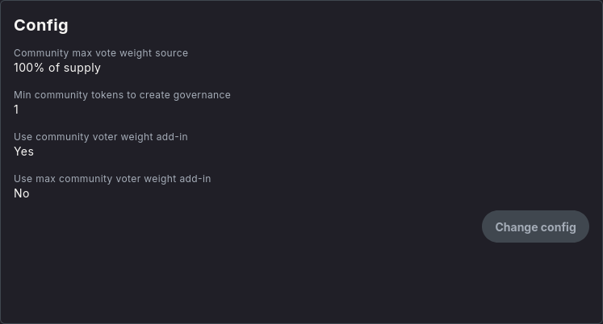
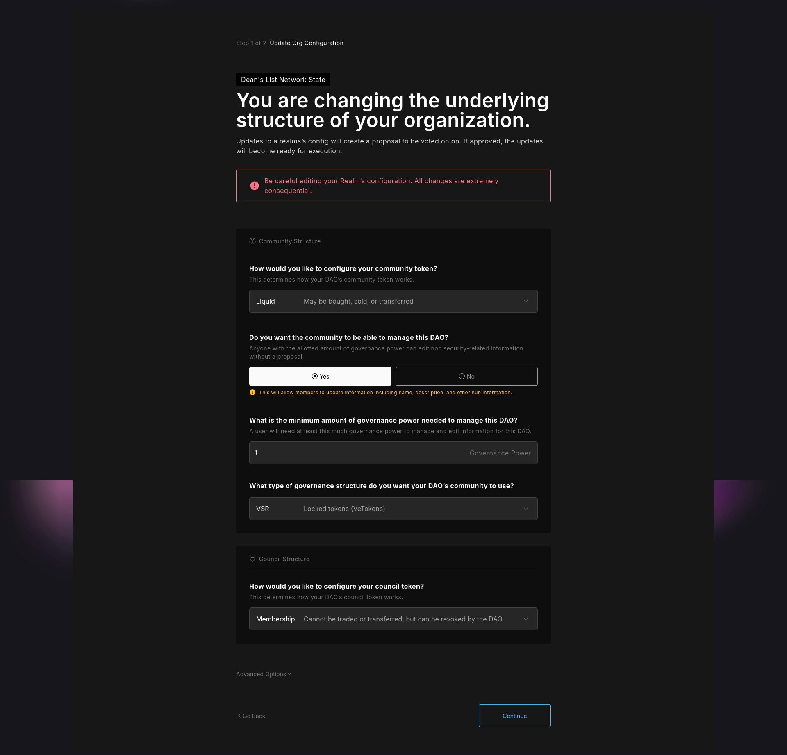
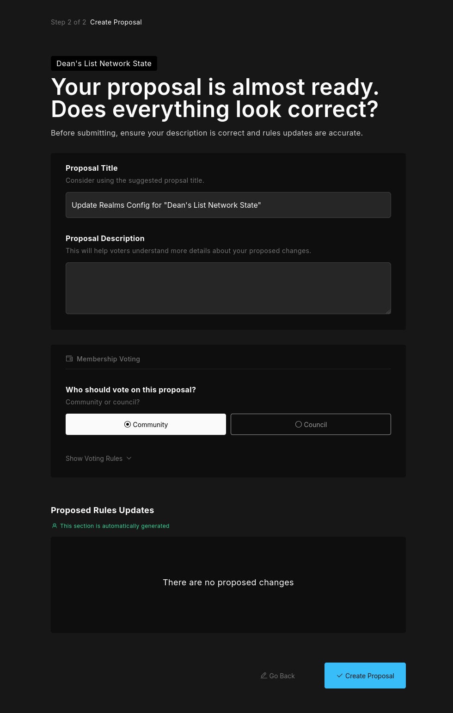

import { Callout, Steps } from 'nextra/components'

# DAO configuration

After a DAO is created, users that detain governance tokens or council tokens can change the DAO configuration.

<Callout type="error" emoji="🚨">
For safe measures against DAO attacks make sure you DAO configuration has a **high minimum of governance tokens** for it to be altered.
</Callout>

## Initial Config Visualisation

<Callout type="info" emoji="ℹ️">
**Dean's List Network State DAO** is used below for example purposes.
</Callout>

After a DAO is deployed the configuration of a DAO can be found in **`Params`**. 

### Parameters

Upon opening **`Params`** you will find the DAO main addresses, configuration & governances (treasuries).

### Addresses

In the addresses section users are able to see:

* **Pubkey**: Address of the DAO 
* **Authority 'x DAO Treasury'**: Realm authority, usually set to one of the DAO wallets, the authority controls DAO configuration.
* **Owner 'Governance Program'**: spl-governance instance used by the DAO.
* **Community Mint**: Address of the chosen governance token.
* **Council Mint**: Address of the council token.

### Config

In the config section users are able to see:
* **Community max vote weight source**: Percentage of the token supply considered for quorum or absolute number of the token supply or set number by the DAO.
* **Min community tokens to create governance**: It is what it says.
<Callout type="info" emoji="ℹ️">
For **Multisig DAOs** without the community governance token, this value is irrelevant and it's defaulted to an arbitrary number of **1,000,000**.
</Callout>
* **Use community voter weight add-in**: Indicates whether voter weight governance plugin is used by the DAO.
* **Use max community voter weight add-in**: Indicates whether max voter weight governance plugin is used by the DAO.

### Governance (Treasuries)

In the governances section users are able to see the DAO treasury/ treasuries and their parameters, accounts & statistics.

For every treasury created an authority is also given for each.

## Config Modification

<Callout type="info" emoji="ℹ️">
Only users with sufficient governance tokens can propose configuration changes to maintain DAO security.
</Callout>

### Prerequisites for Config Changes

Before modifying DAO configuration, ensure you have:

* Sufficient governance tokens to meet the minimum proposal threshold
* Understanding of the proposed changes and their impact
* Community consensus or discussion around the modification

### Config Modification

<Steps>
### Step 1 - Access DAO Configuration

Navigate to your DAO's **Params** section and review the current configuration settings.

### Step 2 - Select Configuration Type

Click on **"Change Config"** to start proposing configuration changes.

Choose the type of configuration you want to modify:

**How would you like to configure your community token**: Liquid, Disabled, Membership
* Liquid - Maybe be bought, sold, or transferred.
* Disabled - This removes voting & managing power for token owners.
* Membership - Cannot be traded or transferred, but can be revoked by the DAO.

**Do you want the community to be able to manage this DAO**: Anyone with the alloted amount of governance power can edit non security-related information without a proposal.

**What is the minimum amount of governance power needed to manage this DAO?**: A user will need at least this much governance power to manage and edit information for this DAO.

**What type of governance structure do you want your DAO's community to use**: Default, VSR, NFT, Civic, QV, Custom
* Default - Governance is based on token ownership
* VSR - Locked tokens (veTokens)
* NFT - Voting enabled and weighted based on NFTs owned
* Civic - Governance based on Civic verification
* QV - Quadratic voting
* Custom - Add a custom program ID for governance structure

**How would you like to configure your council token**: Liquid, Disabled, Membership
* Liquid - Maybe be bought, sold, or transferred.
* Disabled - This removes voting & managing power for token owners.
* Membership - Cannot be traded or transferred, but can be revoked by the DAO.

**What Type of community maximum voter weight do you want to use?**: This determines the maximum voter weight used to calculate voting thresholds. Updating this option requires you to know the maximum supply of your governance token.
* Supply Fraction
* Absolute

### Step 3 - Review and Submit

Review your proposed changes thoroughly before submission. Include:

* **Proposal Title**: Consider using the suggested proposal title
* **Proposal Description**: This will help voters understand more details about your proposed changes
* **Membership Voting**: Community or Council

</Steps>

<Callout type="error" emoji="🚨">
**Security Note**: Always set conservative thresholds to prevent governance attacks. Higher minimum token requirements provide better security against malicious proposals.
</Callout>