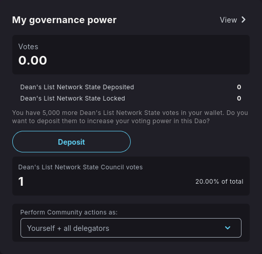
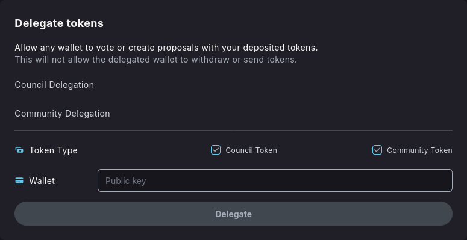
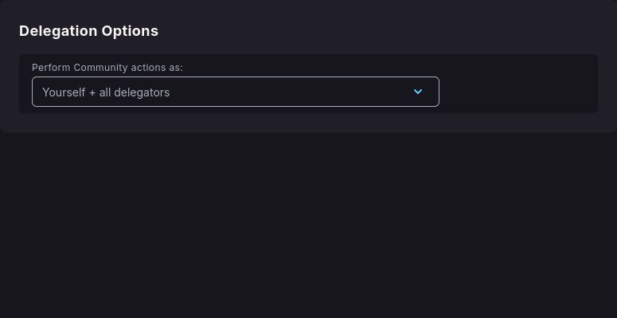

import { Callout, Steps } from 'nextra/components'

## Delegation

Delegation allows governance token holders to assign their voting power to trusted community members, enabling more active participation in DAO governance while maintaining democratic principles.

### Understanding Delegation

Delegation is a powerful feature that:

* **Increases Participation**: Allows token holders to participate indirectly when they cannot vote directly
* **Leverages Expertise**: Enables specialized community members to make informed decisions
* **Maintains Flexibility**: Delegators can reclaim or redirect their voting power at any time
* **Preserves Democracy**: Each token retains its proportional voting weight

### How Delegation Works

When you delegate your tokens:

1. **Voting Power Transfer**: Your governance tokens' voting power is assigned to your chosen delegate
2. **Token Ownership**: You retain full ownership of your tokens
3. **Flexible Management**: You can change or revoke delegation at any time

### Delegating Your Voting Power

<Steps>
### Step 1 - Access Delegation Interface

Navigate to the **"My governance view"** section in your DAO interface.

### Step 2 - Choose a Delegate

Check your current delegation status and available voting power or select a community member to delegate your voting power to. Consider:

<Callout type="info" emoji="ℹ️">
    You can only delegate to 1 wallet. Split delegation is not supported yet.
</Callout>

* **Track Record**: Review their voting history and DAO participation
* **Alignment**: Ensure their values align with your preferences
* **Activity Level**: Choose active participants who regularly vote

### Step 3 - Managing Your Delegations

The user is also able to check the delegation he is receiving for different users.

</Steps>

<Callout type="info" emoji="ℹ️">
Delegation enhances DAO governance by enabling broader participation while leveraging community expertise. It's a powerful tool for creating more effective and representative decision-making processes.
</Callout>

<Callout type="warning" emoji="⚠️">
Choose your delegates carefully. While delegation is reversible, poor delegate choices can impact important DAO decisions during the delegation period.
</Callout>