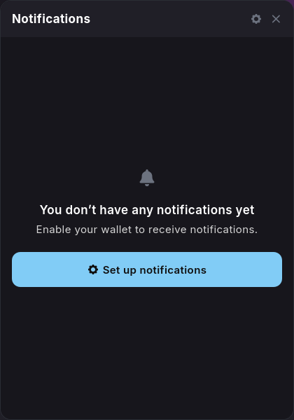
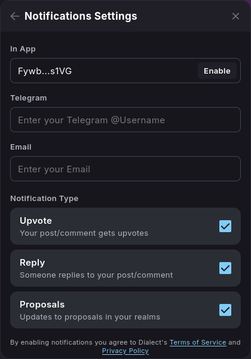

import { Callout, Steps } from 'nextra/components'

## Notifications

Stay informed about important DAO activities through Realms' comprehensive notification system. Effective notification management ensures you never miss critical votes, proposals, or governance events.

### Setting Up Notifications

<Steps>
### Step 1 - Access Notification Settings

Select the **"Notifications"** icon which can be located by the wallet connector.

### Step 2 - Configure Notification Preferences

Choose your preferred notification channels:

* **In-App Notifications**: Alerts within the Realms interface
* **Telegram Notifications**: Messages sent to your registered telegram username
* **Email Notifications**: Messages sent to your registered email address

Choose which events trigger notifications:

* **Upvote**: Your post/ comment gets upvotes
* **Reply**: Someone replies to your post/ comment
* **Proposals**: Updates to proposals in your realms

</Steps>

<Callout type="info" emoji="ℹ️">
Well-configured notifications are essential for active DAO participation. Take time to customize your settings for optimal governance engagement.
</Callout>

<Callout type="default" emoji="👉">
Having trouble with notifications? Get help in the [**Realms Discord**](https://discord.com/invite/VsPbrK2hJk) community support channels!
</Callout>