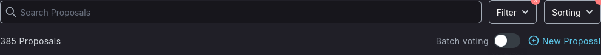
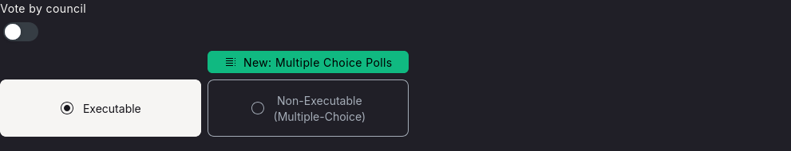
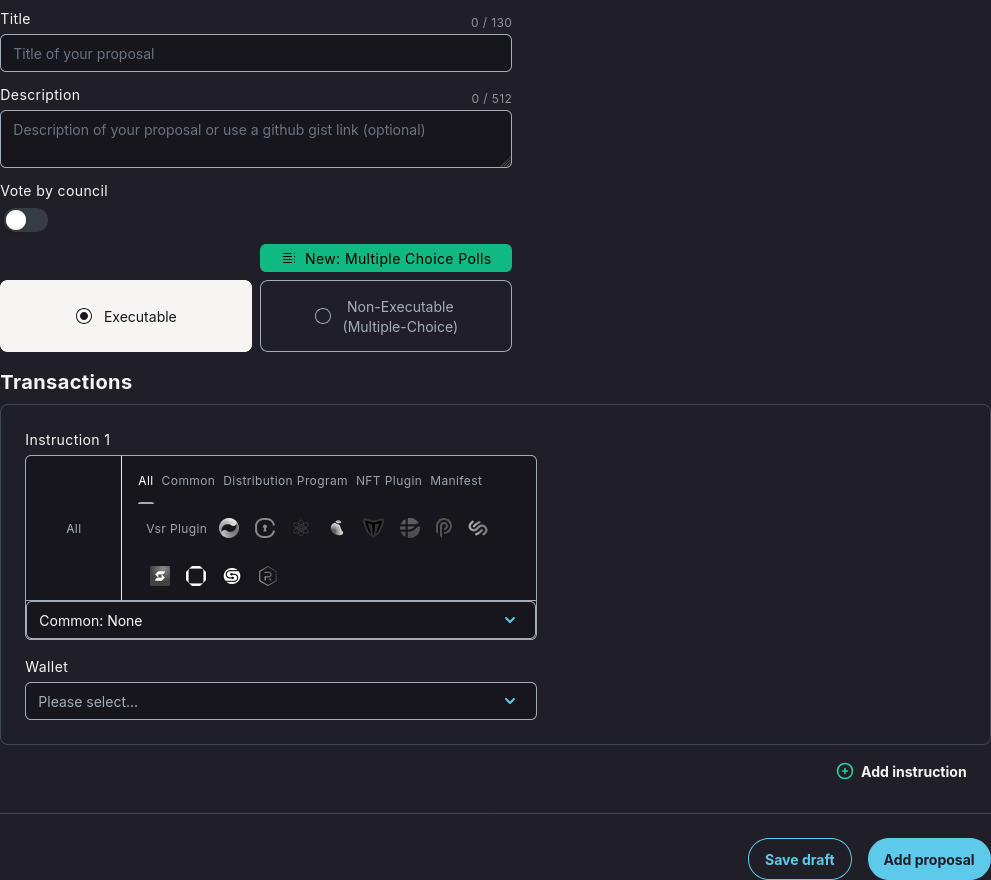
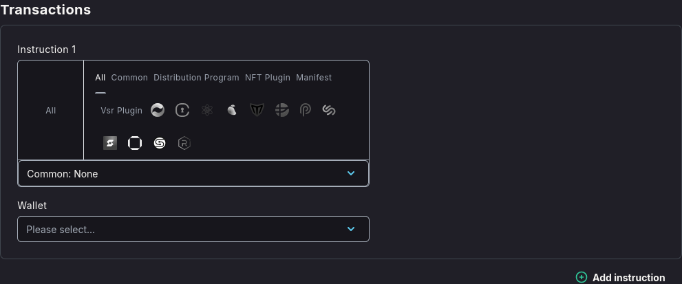
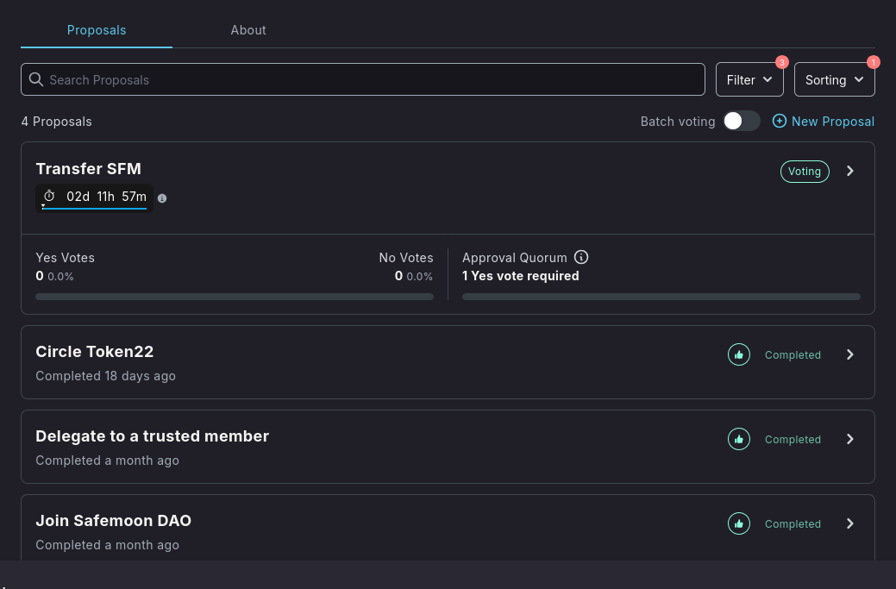
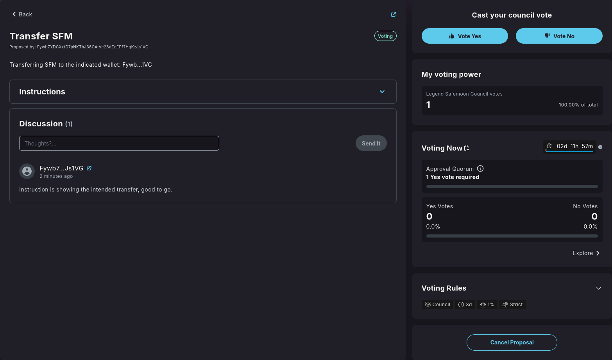
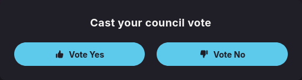
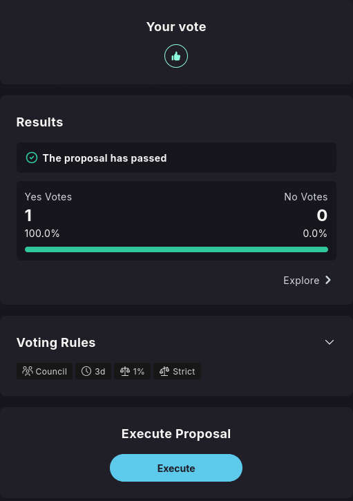

import { Callout, Steps } from 'nextra/components'

## Proposals

Proposals are the foundation of DAO governance, enabling community members to suggest changes, allocate resources, and make collective decisions. This guide covers everything you need to know about creating, managing, and voting on proposals.

### Understanding Proposals

Proposals serve as formal mechanisms for:

* **Decision Making**: Enabling community-driven choices
* **Resource Allocation**: Managing treasury funds and assets
* **Configuration Changes**: Modifying DAO parameters and settings
* **Member Management**: Adding or removing council members
* **Strategic Planning**: Setting long-term DAO direction

### Types of Proposals

#### Treasury Proposals

Manage DAO funds and assets:

* **Spending Proposals**: Allocate treasury funds for specific purposes
* **Investment Proposals**: Invest treasury assets in external opportunities
* **Grant Proposals**: Fund community projects and initiatives
* **Asset Management**: Buy, sell, or transfer DAO-owned assets

#### Governance Proposals

Modify DAO operations and structure:

* **Configuration Changes**: Update voting thresholds, quorum requirements
* **Rule Modifications**: Change governance procedures and policies
* **Member Management**: Add or remove council members

#### General Proposals

Community-driven initiatives:

* **Partnership Agreements**: Collaborate with other DAOs or organizations
* **Strategic Decisions**: Set DAO direction and priorities
* **Policy Changes**: Update community guidelines and standards
* **Public Statements**: Official DAO positions on external matters

### Creating a Proposal

<Steps>
### Step 1 - Access Proposal Creation

Navigate through the DAO page and click **"Create Proposal"**.

### Step 2 - Choose Proposal Type

Select the appropriate proposal type based on your intended action:
* Community Vote - Community Token holders will be able to vote.
* Council Vote - Vote is restricted only to Council token holders.

* Executable - Executable proposals are proposals that contain on-chain instructions, which can be executed once the proposal reaches quorum and further more a finalized state.
* Non-Executable - These proposals are mostly used for signal voting/ multi-choice sentiment within the DAO.

### Step 3 - Configure Proposal Details

Fill in the proposal information:

* **Title**: Clear, descriptive proposal name
* **Description**: Detailed explanation of the proposal
* **Instructions**: Specific actions to be executed if approved

### Step 4 - Add Instructions (Executable)

For executable proposals, you can select instructions from the current list such as:

* **Treasury Transfers**: Specify recipient addresses and amounts
* **Configuration Changes**: Define new parameter values
* **DeFi Actions**: Staking, swaps & lending

</Steps>

### Voting on Proposals

#### Voting Process

<Callout type="info" emoji="ℹ️">
    This example will follow a council proposal.
</Callout>

<Steps>
### Step 1 - Review Active Proposals

Browse active proposals in the governance interface.

### Step 2 - Analyze Proposal Details

Thoroughly review:

* **Proposal Description**: Understand the purpose and impact
* **Instructions**: Review what will be executed if approved
* **Discussion**: Read community comments and debates
* **Voting Status**: Check current vote counts and time remaining

### Step 3 - Cast Your Vote

Choose your voting position:

* **Yes**: Support the proposal
* **No**: Oppose the proposal

### Step 4 - Confirm Vote Transaction

Submit your vote through a transaction:

* **Voting Weight**: Based on your token holdings or delegation
* **Transaction Fee**: Pay required Solana network fees
* **Reversible**: Votes can be changed or withdrawn once submitted

</Steps>

### Proposal Lifecycle

#### Draft Phase

* **Creation**: Proposal is created but not yet active
* **Community Review**: Members can review and provide feedback
* **Revisions**: Creators can modify proposal details

#### Voting Phase

* **Active Voting**: Community members cast their votes
* **Discussion**: Ongoing debate and analysis
* **Vote Counting**: Real-time tracking of vote tallies

#### Execution Phase

* **Instruction Execution**: Automatic execution of approved instructions
* **Completion**: Proposal is finalized and effects are implemented

<Callout type="info" emoji="ℹ️">
Proposals are the primary mechanism for DAO evolution and decision-making. Active participation in the proposal process is essential for effective governance.
</Callout>

<Callout type="warning" emoji="⚠️">
Always verify proposal instructions carefully, especially for treasury transfers. Approved proposals with incorrect instructions cannot be reversed.
</Callout>

<Callout type="default" emoji="👉">
Need help with proposals? Join the [**Realms Discord**](https://discord.com/invite/VsPbrK2hJk) for community support and guidance!
</Callout>