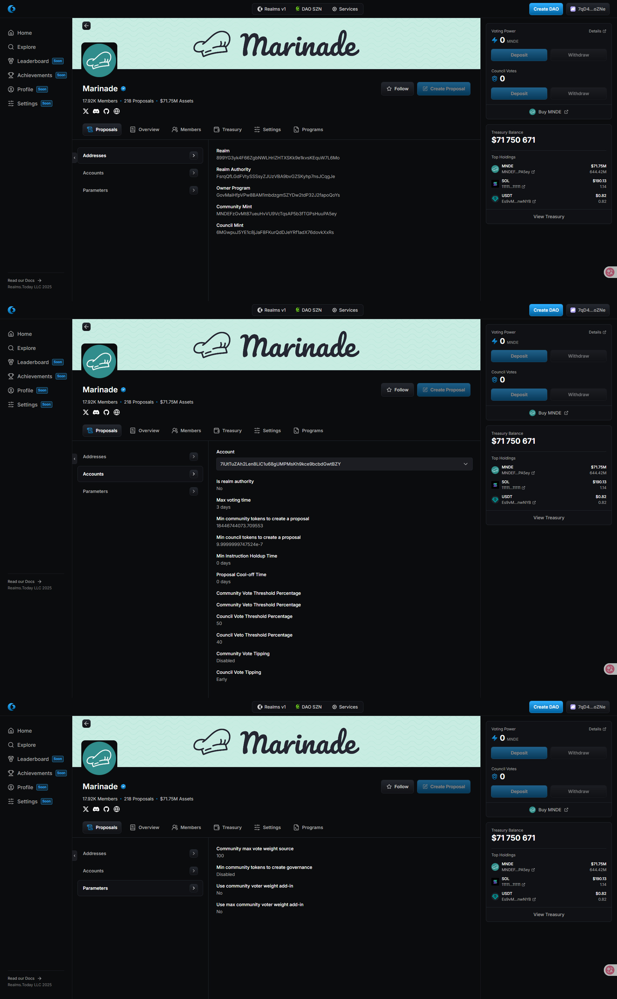
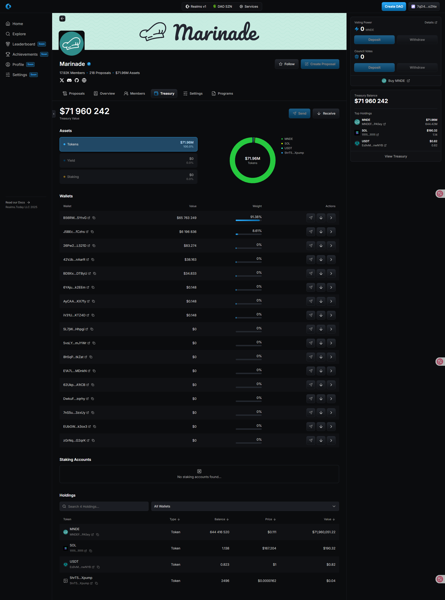
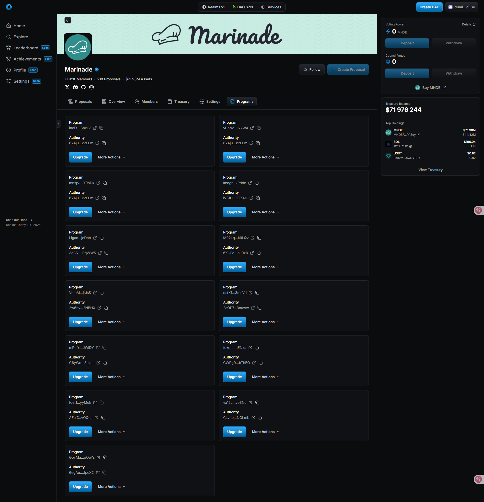

import { Callout, Steps } from 'nextra/components'

# Governance UI

## Governance UI

You most likely use the web-based UI as the primary point of interaction with the SPL Governance program. Therefore, we will conclude this article with a brief overview of the discussed concepts in the context of the UI.

## Creating a Realm

<Callout type="info" emoji="ℹ️">
    Coming soon.
</Callout>

## Let's discuss the most important parts of the UI

<Steps>
### My governance power

<Callout type="info" emoji="ℹ️">
    Coming soon.
</Callout>

### Realm Settings

This section shows the settings of the **`Realm`** and allows for changes. 
   
<Callout type="info" emoji="ℹ️">
    The user will can change the configuration of the **`Realm`** (stored in **`RealmConfigAccount`**) in the top right corner by clicking on **`Config -> Change Config`**. (**Legacy Only**)

    All **`Governance`** instances are listed below, and the voting settings can be changed by clicking on the **`Change Config`** button. **(Legacy Only)**

    The above is only available in Legacy at the moment.
</Callout>

There are other tabs on the left side of the list of **`Governance`** instances, including **`Accounts`**, where the user can list all related accounts to the Governance.
    
The **`Accounts`** tab lists the **`native treasury`** wallet, ATA token wallets managed by the governance, and program accounts or a mint, if available.

### DAO Wallets

This section provides a different perspective on the **`Governance`** accounts.

<Callout type="info" emoji="ℹ️">
    Importantly, the user can create a new Governance instance by clicking on the **`New DAO wallet`** button. (**Legacy Only**)

    **`Native treasury`** addresses show a list of processed transactions. (**Legacy Only**)

    The `Rules` tab provides a way to change **`Governance`** parameters (similar to the **`Params`** subpage), and the **`Treasury`** and **`NFTs`** tabs provide information about the assets. (**Legacy Only**)

    The above is only available in Legacy at the moment.
</Callout>

The list below the button represents the addresses of the **`native treasury`** wallets (every **`Governance`** has one).

To add an asset or deposit to a wallet/ treasury, the user can click on the **`receive icon button`** on the action column or copy the walet/ treasury address.

### Programs

This section allows the user to manage the **`upgrade authority`** of programs and do code upgrades. 

<Callout type="info" emoji="ℹ️">
    The **`New program button`** creates a new program type **`Governance`** (see _Different types of governances_ → [multi-sig](../setup/daomultisig.mdx), [community token](../setup/daotoken.mdx) & [nft](../setup/daonft.mdx)) and takes over management power for the program.
</Callout>

### New proposal

<Callout type="info" emoji="ℹ️">
    Coming soon.
</Callout>
</Steps>
